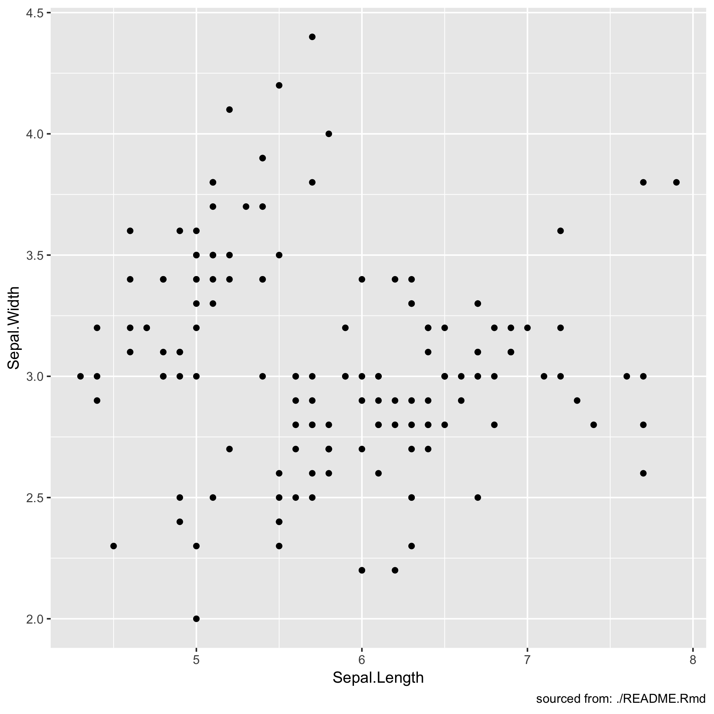

<!-- README.md is generated from README.Rmd. Please edit that file -->

# whereami

The goal of whereami is to reliably find where command is run from.

## Installation

``` r
remotes::install_github("yonicd/whereami")
```

## Example

``` r
library(whereami)
library(ggplot2)
```

### General


### Interactive Rmd

``` r
whereami()
```

``` r
[1] "./README.Rmd"
```

**note**: Currently the full render of rmarkdown doesnt not work (since
`whereami()`) depends on `rstudioapi` and rmarkdowns are rendered in a
non-interactive environment.

### Plots

``` r
ggplot(iris) + 
  aes(x=Sepal.Length,y=Sepal.Width) + 
  geom_point() + 
  labs(caption = sprintf('sourced from: %s',whereami()))
```



### Shiny


