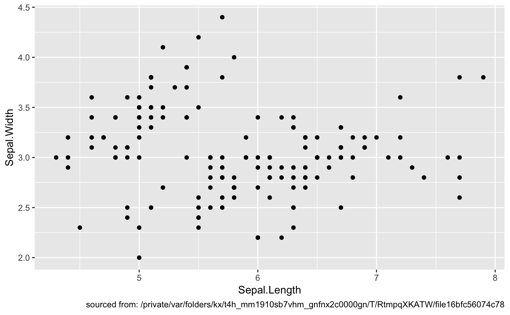

<!-- README.md is generated from README.Rmd. Please edit that file -->

[](https://cran.r-project.org/package=whereami)
[](https://cran.r-project.org/package=whereami)
[](https://travis-ci.org/yonicd/whereami)
[](https://codecov.io/github/yonicd/whereami?branch=master)
[](http://tinyurl.com/y5c5voy3)


# whereami

The goal of whereami is to reliably find where command is run from.

## Installation

``` r
remotes::install_github("yonicd/whereami")
```

## Example

``` r
library(whereami)
library(ggplot2)
```

### General

``` r
whereami()
#> ── Running From: ./README.Rmd ────────────────────
```

### Plots

``` r

ggplot(iris) + 
  aes(x=Sepal.Length,y=Sepal.Width) + 
  geom_point() + 
  labs(caption = sprintf('sourced from: %s',whereami()))
```



### Shiny


## Non RStudio session

If you are running a non RStudio script ie from terminal R/Rscript then
the package falls back to `thisfile()`, which has been migrated from
[rprojroot::thisfile()](https://rprojroot.r-lib.org/reference/thisfile.html).

In this case the traceback functionality of `whereami()` to return the
line where the function was sourced is not enabled.
