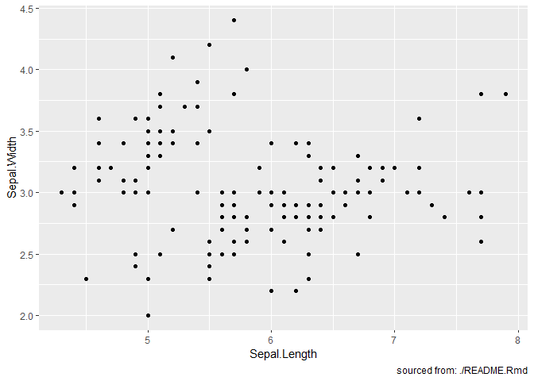

<!-- README.md is generated from README.Rmd. Please edit that file -->

[](http://tinyurl.com/y5c5voy3)

# whereami

The goal of whereami is to reliably find where command is run from.

## Installation

``` r
remotes::install_github("yonicd/whereami")
```

## Example

``` r
library(whereami)
library(ggplot2)
```

### General

<!--  -->

### Interactive Rmd

``` r
whereami()
#> ── Running From: Console ──────────────────────────────────────────────────────────
```

### Plots

``` r

ggplot(iris) + 
  aes(x=Sepal.Length,y=Sepal.Width) + 
  geom_point() + 
  labs(caption = sprintf('sourced from: %s',whereami()))
```



<!-- ### Shiny -->

<!--  -->

## Non RStudio session

If you are running a non RStudio script ie from terminal R/Rscript then
the package falls back to
[rprojroot::thisfile()](https://rprojroot.r-lib.org/reference/thisfile.html).
In this case the traceback functionality of `whereami` to return the
line where `whereami()` was sourced is not enabled.
